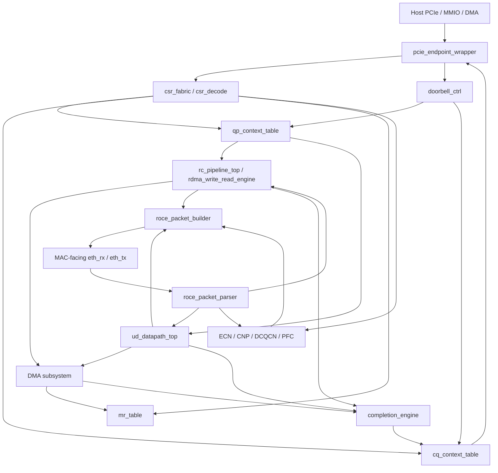
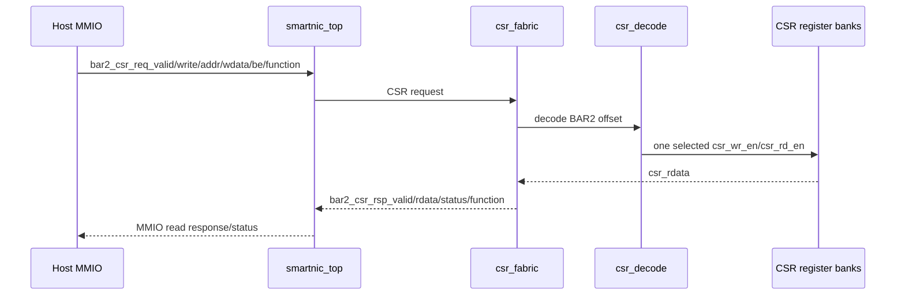
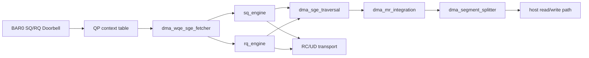
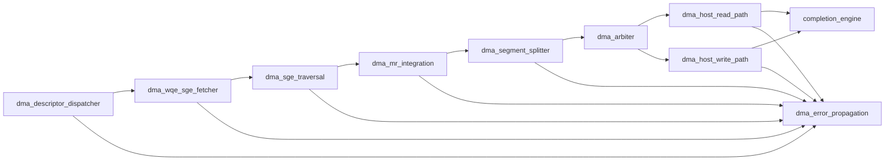
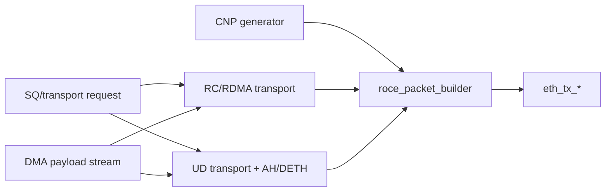
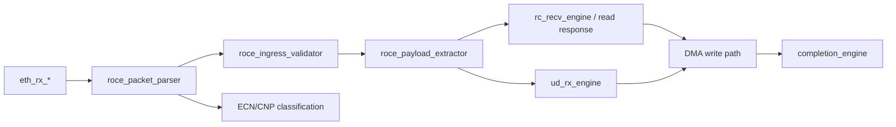
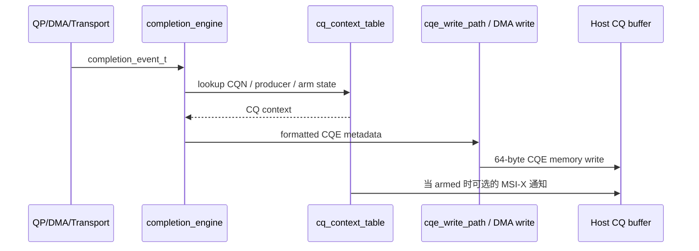

# 硬件模块架构

本文是 16.1 的硬件模块架构总览，描述当前 RDMA SmartNIC DUT 的 RTL 层次、顶层数据路径、控制路径、队列路径、DMA 路径、packet 路径、completion/error 路径和关键内部接口。它只记录现有硬件结构和原型边界，不改变 RTL 行为。

相关源文件：

- `rtl/top/smartnic_top.sv`：硬件顶层。
- `rtl/common/smartnic_pkg.sv`：共享位宽、枚举、packed struct、状态和错误码。
- `rtl/pcie/`：PCIe endpoint、BAR、MSI-X、function identity。
- `rtl/reg/`：BAR2 CSR decode/fabric 和 mailbox。
- `rtl/doorbell/`：BAR0 Doorbell decode、ownership check、SQ/RQ/CQ arm handler。
- `rtl/qp/`、`rtl/cq/`、`rtl/mr/`：QP/CQ/MR/MW 管理。
- `rtl/dma/`：WQE/SGE、MR integration、split、host read/write、arbiter、error propagation。
- `rtl/packet/`、`rtl/transport/`、`rtl/congestion/`：RoCEv2 parser/builder、RC/UD transport、ECN/CNP/DCQCN/PFC。

## 顶层层次结构

`smartnic_top` 是当前 DUT 顶层。它使用一个外部 `clk` 和低有效 `rst_n`，内部用两级同步生成 `core_rst_n`。当前原型仍以单 core clock 集成大多数模块；真实 FPGA/ASIC 多时钟域、PCIe hard IP clock、MAC TX/RX clock 和 CDC 评审见 `docs/24-fpga-prototype-checklist.md`。



`smartnic_top` 中实例化的主要模块：

| 实例 | 模块 | 职责 |
| --- | --- | --- |
| `u_pcie_endpoint` | `pcie_endpoint_wrapper` | PCIe 硬核 IP 适配边界，处理 TLP/Config/DMA/MSI-X 风格信号 |
| `u_csr_fabric` | `csr_fabric` | BAR2 CSR 读写路由，分发到 QP/CQ/MR/AH/MSI-X/SR-IOV/拥塞控制寄存器组 |
| `u_doorbell_ctrl` | `doorbell_ctrl` | BAR0 SQ/RQ/CQ arm Doorbell 解码和队列索引更新提示 |
| `u_rc_pipeline_top` | `rc_pipeline_top` | 最小 RC Send/Recv 管线钩子，用于数据包/完成集成 |
| `u_ud_datapath_top` | `ud_datapath_top` | UD Send/Recv 集成，含 AH 查找、DETH/Q_Key 和 CQE 元数据 |
| `u_packet_parser` | `roce_packet_parser` | 以太网/IPv4/UDP/RoCEv2 首拍元数据提取 |
| `u_packet_builder` | `roce_packet_builder` | 单拍 RoCEv2 帧构造，支持 CNP/RC/RDMA/UD 路径 |
| `u_ecn_marker`、`u_cnp_classifier`、`u_cnp_generator`、`u_dcqcn`、`u_pfc_scheduler`、`u_tx_pacer` | 拥塞控制模块 | ECN/CNP 检测、DCQCN 状态更新、令牌桶 pacing 和 PFC 调度器门控 |
| `u_qp_table` | `qp_context_table` | QP context 存储、状态、队列索引、PD/CQ 引用和 owner function |
| `u_cq_table` | `cq_context_table` | CQ context 存储、生产者/消费者状态、arm 状态和溢出/状态元数据 |
| `u_completion_engine` | `completion_engine` | 将工作结果归一化为 CQE 元数据和 CQ 查找/写回意图 |
| `u_dma_dispatcher` | `dma_descriptor_dispatcher` | 统一 DMA descriptor 分发边界 |
| `u_mr_table` | `mr_table` | MR/MW entry 存储、查找、边界和 refcount 操作 |
| `u_rc_send_engine` | `rc_send_engine` | RC 发送侧 PSN/未完成数据包/重试引擎实例，保留用于传输集成 |

## 外部接口

`smartnic_top` 暴露以下面向硬件的边界：

| 接口 | 方向 | 用途 |
| --- | --- | --- |
| `pcie_rx_*` / `pcie_tx_*` | 主机 PCIe TLP 流 | 简化的 PCIe 硬核 IP 流边界 |
| `bar2_csr_req_*` / `bar2_csr_rsp_*` | 主机 MMIO 控制 | BAR2 CSR 访问模型，面向软件可见控制/状态 |
| `bar0_db_*` | 主机 MMIO Doorbell | BAR0 SQ/RQ/CQ arm 快速路径提交 |
| `eth_rx_*` / `eth_tx_*` | MAC 包流 | 简化的 512-bit 以太网/RoCEv2 RX/TX 帧边界 |
| `pfc_event_*` | MAC/控制事件 | PFC PAUSE/RESUME 注入到拥塞调度器 |
| `*_test_*` 钩子 | 验证/原型钩子 | 最小 RC/RDMA/UD 激励，用于顶层尚未完全接入完整 SQ/RQ fetch 的路径 |
| `debug_*_status` | 调试输出 | 粗粒度 QP/CQ/transport/congestion 可观测性，用于测试 |

大多数内部路径使用显式 ready/valid 握手机制。跨模块请求保留 `desc_id`、`qpn`、`cqn`、`owner_function`、`pd_id`、operation/opcode 和 status/error 字段，以便后续的完成、调试、所有权和清理逻辑能够关联同一工作项。

## 控制路径

主机控制通过 BAR2 CSR 请求到达硬件。最小顶层控制路径为：



CSR fabric 路由到 QP、CQ、MR/MW、AH、MSI-X、SR-IOV 和拥塞控制的最小寄存器组。这些寄存器组校验 BAR2 解码、byte-enable 写入、对齐的 32-bit 访问和复位归零行为。完整的资源生命周期命令序列由驱动/mailbox 模型以及各子系统文档中记录的管理模块处理。

主机快速路径提交通过 BAR0 Doorbell 到达硬件：

```text
bar0_db_* -> doorbell_ctrl
          -> sq_doorbell_handler -> qp_context_table.sq_pi_update + sq_scheduler_valid
          -> rq_doorbell_handler -> qp_context_table.rq_pi_update + rq_post_valid
          -> cq_arm_doorbell_handler -> cq_context_table.cq_arm
```

Doorbell 所有权检查使用 `owner_function` 元数据和 QP/CQ 资源标识。无效解码、不支持的类型、所有者不匹配或非法标志通过处理程序状态/调试路径报告，不会更新无关队列状态。

MSI-X/通知分散在 `cq_context_table`、`cq_notification`、`pcie_msix` 和顶层 completion/CQ 钩子中。在顶层，CQ arm 状态已连接；完整中断生成取决于底层 PCIe/CQ 模块中的 CQE 写回和 MSI-X 表编程。

## 队列与工作请求路径

QP、CQ 和 MR 生命周期由管理器模块和 context table 表示：

- `qp_context_table` 存储 QP 类型/状态、owner function、PD、SQ/RQ 基地址/深度/索引、CQ 映射、PSN 和重试状态。
- `qp_lifecycle_manager`、`qp_state_validator` 和 `qp_cleanup_manager` 处理 create/modify/query/destroy/error 转换和 flushed 清理行为。
- `sq_engine` 在连接到 WQE fetch 时解码 Send、RDMA Write、RDMA Read 和 UD 风格的 WQE。
- `rq_engine` 消费 Recv WQE 以接收入站 Send/UD 接收载荷。
- `cq_context_table`、`cq_index_manager`、`cq_notification` 和 `cqe_write_path` 跟踪 CQ 状态、写入 CQE 并通知软件。

预期的队列路径为：



当前顶层集成仍然暴露多个 `*_test_*` 钩子用于 RC Send/Recv、RDMA Write/Read 和 UD Send/Recv，因为完整的 SQ/RQ WQE fetch-to-transport 接线是分阶段进行的。不受支持或非法的 WQE 会被相应的 SQ/RQ/DMA/transport 阶段拒绝，并预期产生错误状态而非静默副作用。

排序是按 QP 和操作类型进行的：

- SQ 生产者/消费者索引来自 Doorbell 和 QP context 状态。
- RC transport 在 `rc_send_engine` 和 `rc_recv_engine` 中跟踪 PSN 和未完成数据包。
- RDMA Read 请求方逻辑当前支持 `rc_rdma_read_engine` / `rdma_write_read_engine` 路径中的最小单未完成上下文。
- DMA 仲裁和分段阶段保留 descriptor 元数据，使 completion/error propagation 可以识别原始 WR。

## DMA 数据路径

DMA 引擎被分解为窄阶段，而非单个单片模块：



主机到卡和卡到主机方向：

- 主机读取 Send/RDMA Write 载荷：protected/split segment -> `dma_host_read_path` -> PCIe read request -> payload stream 朝向 transport/packet TX。
- 主机写入 Recv/RDMA Read response/入站写入载荷：protected/split segment + payload stream -> `dma_host_write_path` -> PCIe write request -> write done/completion。
- WQE/SGE fetch：队列 base/index/stride -> `dma_wqe_sge_fetcher` -> host read request/response -> WQE 解码和 SGE stream。
- CQE 写回：completion event -> CQ 查找/地址计算 -> `cqe_write_path`/DMA write。

MR 和保护交互：

```text
dma_sge_traversal
  -> mr_key_checker
  -> mr_access_checker
  -> mr_pd_checker
  -> VA-to-PA 转换
  -> MR/MW refcount 递增
  -> protected_dma_segment_t
```

原型中的重要限制：

- DMA host read/write 模块定义了 PCIe request/response 接口，但不实例化真实的 PCIe root complex。
- `DMA_MAX_READ_BYTES`、`DMA_MAX_WRITE_BYTES`、PMTU 和 4KB 分段以简单的分段边界建模。
- 一些顶层路径仍使用 test hooks 而非完全连接的 SQ/RQ fetch 路径。
- 真实 IOMMU、page walk、multi-beat packet payload assembly 和完整 transport retry integration 仍为较低层文档中的显式 TODO。

## Packet TX/RX 路径

### TX



packet builder 可以为当前建模的单拍帧构造以太网/IPv4/UDP/BTH 以及 RETH、AETH、DETH、ImmDt 和 CNP 元数据。`roce_icrc_placeholder` 记录了 ICRC 边界行为；完整线速 multi-beat 组帧和真实 FCS 属于 MAC/IP-wrapper 的职责。

当前原型中顶层 builder 选择使用固定优先级：拥塞 CNP 优先，然后是 RC Send/Recv、RDMA Write/Read 和 UD Send。这使得烟雾测试具有确定性。

### RX



Parser/validator 职责：

- 提取以太网、可选 VLAN、IPv4/IPv6 ECN 元数据、UDP、BTH、RETH、AETH、DETH、立即数据和 ICRC 字段。
- 在消费接收队列之前拒绝无效的 EtherType/IP/UDP/BTH/opcode/checksum/length。
- 保留数据包元数据供 transport、congestion 和 debug 使用。

数据包丢弃和畸形数据包在 parser/validator/transport 阶段处理，预期增加计数器或发出 drop/error 元数据而不写入主机内存。

自环回支持当前是一种验证模式而非单一 RTL 模式：CNP builder/parser、RC/UD test hooks、packet BFM 和 FPGA checklist 描述了内部、MAC/PHY 和主机驱动的自环回选项。

## Completion 与 Error 路径

成功完成流程：



支持的完成类别包括 Send、Recv、RDMA Write、RDMA Read response completion、UD Send/Recv 以及相应路径连接时的 error completion。CQE 格式和用户态轮询记录在 `docs/14-cq-management.md` 和 `docs/userspace-provider.md` 中。

错误流程：

```text
descriptor / fetch / traversal / MR / split / host read / host write / arbiter error
  -> dma_error_propagation
  -> completion status mapping
  -> completion_engine
  -> CQE writeback
  -> 对于 fatal 错误，可选的 QP error request
```

代表性错误来源：

- CQ 溢出或无效 CQ context。
- MR lookup miss、key direction error、PD mismatch、permission denied、bounds error 或 MW invalidating。
- SGE length underrun/overrun、SGE overlap、address overflow。
- 不支持的操作码、畸形 descriptor 或 WQE fetch error。
- PCIe read/write response error、tag mismatch 或 length mismatch。
- Packet validation failure、PSN mismatch、RNR、Q_Key mismatch 或无效目标 QPN。

Fatal DMA/transport 错误可以请求 QP error cleanup；QP cleanup manager 负责 transition/flush 语义并阻止新工作。

## 关键内部接口

| 接口族 | 生产者 | 消费者 | 载荷/用途 | 握手机制 |
| --- | --- | --- | --- | --- |
| CSR request/response | BAR2 MMIO / `smartnic_top` | `csr_fabric` 和 CSR 寄存器组 | addr、write/read、wdata、byte enable、function ID、rdata/status | request valid/ready, response valid/ready |
| Doorbell | BAR0 MMIO / `doorbell_ctrl` | QP/CQ context tables | QPN/CQN、type、producer/consumer index、flags、owner function | valid/ready |
| WQE fetch | SQ/RQ engines | `dma_wqe_sge_fetcher` | queue type、base、index、stride、desc_id、PD | valid/ready + host read response |
| SGE stream | WQE/SGE fetcher | `dma_sge_traversal` | SGE addr/len/lkey/index/last 和 expected total length | valid/ready |
| DMA segment | SGE traversal | MR/split/read/write pipeline | 归一化 VA segment、key、operation、byte offset | valid/ready |
| Protected segment | MR integration | splitter/host DMA | PA、len、MR ref token、access flags | valid/ready |
| Packet metadata | parser/extractor/transport | RC/UD/CNP/packet builder | opcode、QPN、PSN、RETH/AETH/DETH/ImmDt、payload len | valid/ready |
| Completion event | QP/DMA/transport | `completion_engine` | WR ID、opcode、status、byte len、imm/source QPN/vendor error | valid/ready |
| Error event | DMA/packet/transport | error propagation/completion path | source、desc_id、qpn、cqn、status/error code、fatal/retryable | valid/ready |

项目约定避免主要模块之间的隐式共享状态。共享表（如 QP/CQ/MR）通过显式 lookup/update 端口访问，并携带 owner function / PD 元数据以保持 SR-IOV 隔离和保护检查。

## 已实现的能力与限制

当前原型树中已实现：

- PCIe endpoint/config/BAR/MSI-X/SR-IOV 骨架模块。
- BAR2 CSR fabric 和 BAR0 Doorbell 控制路径。
- QP、CQ、MR/MW context table 和 lifecycle/checker 模块。
- DMA descriptor、WQE/SGE fetch、traversal、MR integration、split、host read/write、arbitration 和 error propagation 模块。
- RoCEv2 parser/builder、RC send/receive/read、immediate data、UD TX/RX 和 AH table 模块。
- ECN/CNP/DCQCN/token bucket/PFC 拥塞控制骨架。
- `smartnic_top` 带结构化集成和确定性原型/test hooks。

已知限制 / TODO：

- 完整板级 PCIe/MAC IP 封装已文档化但未在本任务中实现。
- 若干顶层数据路径仍使用 test hooks，而非完全连接的生产 SQ/RQ/WQE 路径。
- Packet builder/parser 主要是单拍原型实现；multi-beat payload assembly 和完整 ICRC/FCS 处理仍然有限。
- RC retry/RNR/ACK/NAK 和 RDMA Read sequencing 以最小可验证状态机存在，而非完整协议合规引擎。
- 真实 PCIe DMA completion ordering、IOMMU/page walk、Linux 内核 RDMA 子系统集成和外部网络互操作性不在本文档任务范围内。
- Driver ABI 细节有意留给 16.2，用户态 Verbs 范围留给 16.3，验证策略留给 16.4。

## 阅读地图

- 顶层集成细节：`docs/23-top-level-integration.md`。
- PCIe/BAR/MSI-X/SR-IOV：`docs/03-pcie-endpoint.md` 至 `docs/08-sriov-function-management.md`。
- Doorbell 和 QP/CQ/MR：`docs/10-doorbell-path.md`、`docs/12-qp-management.md`、`docs/14-cq-management.md`、`docs/15-mr-management.md`。
- DMA 阶段：`docs/17-dma-engine.md`。
- Packet 和 transport：`docs/20-packet-parser.md`、`docs/21-transport-engine.md`。
- 拥塞控制：`docs/22-congestion-control.md`。
- FPGA bring-up checklist：`docs/24-fpga-prototype-checklist.md`。
