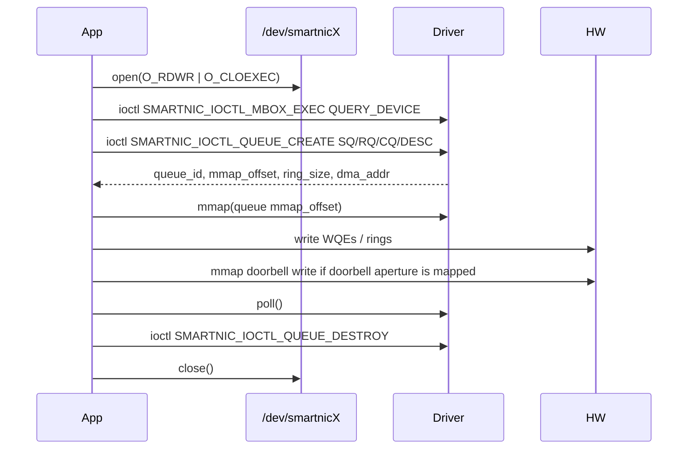

# Linux 驱动 ABI

本文是 16.2 的 Linux kernel driver ABI 说明，覆盖当前 RDMA SmartNIC 原型驱动暴露给用户态的设备节点、ioctl、mmap、资源生命周期、DMA ring 规则、Doorbell 映射、poll 语义和错误码。它描述现有或已约定的 ABI surface，不改变驱动行为。

权威源码文件：

- `include/uapi/linux/smartnic_ioctl.h`：公开 UAPI，用户态必须包含该文件。
- `drivers/linux/smartnic_chrdev.c`：`open`、`release`、`unlocked_ioctl`、`compat_ioctl`、`mmap`、`poll`。
- `drivers/linux/smartnic_queue.c`：queue ioctl、per-file queue ownership、queue mmap。
- `drivers/linux/smartnic_dma.c`：coherent DMA ring 分配与参数校验。
- `drivers/linux/smartnic_mbox.c`：CSR mailbox helper、timeout、device error 到 errno 的映射。
- `drivers/linux/smartnic_pci.c`：PCI probe/remove、BAR mapping、DMA mask、feature discovery。
- `drivers/linux/smartnic_regs.h`：PCI IDs、BAR IDs、CSR offsets、mailbox 与 interrupt 常量。

## ABI 版本与兼容性

当前 ABI 是原型阶段的 Linux character-device ABI。它有意保持很小，不是完整 RDMA verbs kernel ABI。

兼容性约定：

- 用户态应包含 `<linux/smartnic_ioctl.h>`，不要复制 ioctl number 或 struct 定义。
- 每个 ioctl struct 的 `struct_size` 必须设置为 `sizeof(struct ...)`。
- 除非后续 ABI revision 明确说明，否则所有 reserved 字段和 flags 都应写 0。
- `queue_id`、`mmap_offset` 等返回 handle 应视为 opaque cookie。
- UAPI 使用固定宽度 Linux integer type；当前驱动同时支持 native ioctl 和 `CONFIG_COMPAT` 下的 compat dispatch。
- 未知 ioctl command 或错误 ioctl magic 返回 `-ENOTTY`。

## 设备节点与入口点

Probe 后驱动创建如下 character device：

```text
/dev/smartnic0
/dev/smartnic1
...
```

应用通常这样打开设备：

```c
int fd = open("/dev/smartnic0", O_RDWR | O_CLOEXEC);
```

支持的 file operations：

| Operation | Source | 行为 |
| --- | --- | --- |
| `open` | `smartnic_chrdev_open()` | 创建 per-file `struct smartnic_file`；设备 removed/quiescing 时返回 `-ENODEV`，reset active 时返回 `-EAGAIN`。 |
| `release` | `smartnic_chrdev_release()` | 销毁 per-file context，并释放该 file descriptor 仍持有的所有 queue。 |
| `unlocked_ioctl` | `smartnic_chrdev_ioctl()` | 分发 mailbox 与 queue ioctl。 |
| `compat_ioctl` | `smartnic_chrdev_compat_ioctl()` | `CONFIG_COMPAT` 打开时复用 native ioctl dispatch。 |
| `mmap` | `smartnic_chrdev_mmap()` | 映射允许的 doorbell/MMIO BAR 区域，或 per-file coherent queue ring。 |
| `poll` | `smartnic_chrdev_poll()` | 报告 event readiness、command readiness，以及 teardown/error state。 |
| `llseek` | `no_llseek` | 不支持 seek。 |

多个进程可以同时打开同一个设备节点。Queue 资源归创建它的 file descriptor 所有；其他 file descriptor 不能 query、mmap 或 destroy 这些 queue。设备级 mailbox command 由 `mbox_lock` 串行化。

## Probe / Remove 生命周期

Probe 顺序：

```text
pci_enable_device_mem()
pci_request_regions()
dma_set_mask_and_coherent(64-bit, fallback 32-bit)
pci_set_master()
pci_iomap(SMARTNIC_BAR_CONTROL)
optional pci_iomap(SMARTNIC_BAR_DOORBELL)
SMARTNIC_CSR_RESET
SMARTNIC_CSR_VERSION / FEATURES / CAPS / STATUS discovery
smartnic_irq_setup()
smartnic_chrdev_register()
```

Remove 顺序：

```text
smartnic_quiesce()
smartnic_chrdev_unregister()
smartnic_irq_teardown()
unmap BARs
pci_clear_master()
pci_release_regions()
pci_disable_device()
free private state
```

remove 或 quiesce 期间，新的 open/ioctl/mmap 操作返回 `-ENODEV`，poll waiters 看到 `POLLERR | POLLHUP`，per-file release 会释放剩余 queue。

## ioctl ABI 概览

所有 ioctl command 都使用 `include/uapi/linux/smartnic_ioctl.h` 中的 `SMARTNIC_IOCTL_MAGIC` (`'S'`)。

| Command | Number | Direction | Struct | 用途 |
| --- | --- | --- | --- | --- |
| `SMARTNIC_IOCTL_MBOX_EXEC` | `_IOWR('S', 0x01, struct smartnic_ioctl_mbox)` | read/write | `struct smartnic_ioctl_mbox` | 执行一个小型 CSR mailbox command。 |
| `SMARTNIC_IOCTL_QUEUE_CREATE` | `_IOWR('S', 0x20, struct smartnic_ioctl_queue)` | read/write | `struct smartnic_ioctl_queue` | 分配一个由当前 fd 拥有的 coherent DMA ring。 |
| `SMARTNIC_IOCTL_QUEUE_DESTROY` | `_IOW('S', 0x21, struct smartnic_ioctl_queue_destroy)` | write | `struct smartnic_ioctl_queue_destroy` | 销毁当前 fd 拥有的 queue。 |
| `SMARTNIC_IOCTL_QUEUE_QUERY` | `_IOWR('S', 0x22, struct smartnic_ioctl_queue)` | read/write | `struct smartnic_ioctl_queue` | 查询当前 fd 拥有的 queue 的安全 metadata。 |

不支持或预留给未来的 ioctl 不会被静默接受，而是返回 `-ENOTTY`。

## `SMARTNIC_IOCTL_MBOX_EXEC`

结构体：

```c
struct smartnic_ioctl_mbox {
        __u32 struct_size;
        __u16 opcode;
        __u16 flags;
        __u32 in_len;
        __u32 out_len;
        __u32 data[SMARTNIC_IOCTL_MAX_DATA_DWORDS];
        __s32 status;
        __u32 reserved;
};
```

字段规则：

| 字段 | 方向 | 规则 |
| --- | --- | --- |
| `struct_size` | input | 必须等于 `sizeof(struct smartnic_ioctl_mbox)`。 |
| `opcode` | input | 由硬件/固件解释的 CSR mailbox command opcode。 |
| `flags` | input | 预留；当前用户态应写 0。 |
| `in_len` | input | 输入字节数，必须 dword aligned，最大 `SMARTNIC_IOCTL_MAX_DATA_DWORDS * 4` bytes。 |
| `out_len` | input | 输出字节数，必须 dword aligned，最大 `SMARTNIC_IOCTL_MAX_DATA_DWORDS * 4` bytes。 |
| `data[4]` | input/output | 最多四个 32-bit command 参数或 response dword。 |
| `status` | output | success-copyout path 上从 `smartnic_mbox_exec()` 结果复制出的 errno-style status。 |
| `reserved` | reserved | 必须为 0。 |

调用顺序：

1. 打开 `/dev/smartnicX`。
2. 填写 `struct_size`、`opcode`、长度字段和输入 dword。
3. 调用 `ioctl(fd, SMARTNIC_IOCTL_MBOX_EXEC, &mbox)`。
4. 如果返回 0，读取 `data[]` 和 `status`。

常见 errno：

| errno | 含义 |
| --- | --- |
| `-EFAULT` | 用户指针 copy 失败。 |
| `-EINVAL` | `struct_size` 错误、长度过大、长度不是 dword aligned，或 mailbox buffer 无效。 |
| `-ENODEV` | 设备已移除、quiescing，或 control BAR 不可用。 |
| `-EAGAIN` | device reset 正在进行。 |
| `-ETIMEDOUT` | 硬件 mailbox 未在 `SMARTNIC_MBOX_TIMEOUT_US` 内完成。 |
| `-EOPNOTSUPP` | 设备返回 `SMARTNIC_MBOX_ERR_INVALID_CMD`。 |
| `-EACCES` | 设备返回 `SMARTNIC_MBOX_ERR_PERMISSION`。 |
| `-EPERM` | 设备返回 `SMARTNIC_MBOX_ERR_BAD_STATE`。 |
| `-EBUSY` | 设备返回 `SMARTNIC_MBOX_ERR_BUSY`。 |
| `-ENOSPC` | 设备返回 `SMARTNIC_MBOX_ERR_NO_RESOURCE`。 |
| `-EIO` | 设备返回 `SMARTNIC_MBOX_ERR_HW`，或 completion state 格式异常。 |

## Queue ioctl ABI

Queue 常量：

| Constant | Value | 含义 |
| --- | --- | --- |
| `SMARTNIC_QUEUE_TYPE_SQ` | `1` | Send Queue ring。 |
| `SMARTNIC_QUEUE_TYPE_RQ` | `2` | Receive Queue ring。 |
| `SMARTNIC_QUEUE_TYPE_CQ` | `3` | Completion Queue ring。 |
| `SMARTNIC_QUEUE_TYPE_DESC` | `4` | Descriptor/control ring。 |

`SMARTNIC_IOCTL_QUEUE_CREATE` 和 `SMARTNIC_IOCTL_QUEUE_QUERY` 使用：

```c
struct smartnic_ioctl_queue {
        __u32 struct_size;
        __u32 type;
        __u32 depth;
        __u32 desc_size;
        __u32 flags;
        __u32 queue_id;
        __u64 mmap_offset;
        __u64 ring_size;
        __u64 dma_addr;
        __u32 producer_index;
        __u32 consumer_index;
        __u32 reserved[4];
};
```

Create input fields：

| 字段 | 规则 |
| --- | --- |
| `struct_size` | 必须等于 `sizeof(struct smartnic_ioctl_queue)`。 |
| `type` | 必须是 `SMARTNIC_QUEUE_TYPE_SQ`、`RQ`、`CQ`、`DESC` 之一。 |
| `depth` | 非零 power of two。 |
| `desc_size` | 非零，并且按 `SMARTNIC_DMA_DESC_ALIGN`（8 bytes）对齐。 |
| `flags` | 预留；当前用户态应写 0。 |
| `reserved[]` | 必须为 0。 |

Create output fields：

| 字段 | 含义 |
| --- | --- |
| `queue_id` | opaque driver queue handle；当前从全局单调 counter 分配，从 1 开始。 |
| `mmap_offset` | 传给 `mmap()` 映射该 queue 的 offset cookie。 |
| `ring_size` | coherent DMA ring size，单位 bytes。 |
| `dma_addr` | 用于硬件编程的 DMA address；kernel virtual address 永不暴露。 |
| `producer_index` / `consumer_index` | 当前软件可见 index state。 |

`SMARTNIC_IOCTL_QUEUE_DESTROY` 使用：

```c
struct smartnic_ioctl_queue_destroy {
        __u32 struct_size;
        __u32 queue_id;
};
```

Queue ioctl errno：

| ioctl | errno | 含义 |
| --- | --- | --- |
| CREATE | `-EFAULT` | 用户 copy 失败。 |
| CREATE | `-EINVAL` | struct size 错误、queue type 无效、depth/desc_size 为 0、depth 非 power-of-two、desc_size 未对齐，或 allocation size 超限。 |
| CREATE | `-EOVERFLOW` | `depth * desc_size` 溢出 `size_t`。 |
| CREATE | `-ENOMEM` | queue object 或 coherent DMA allocation 失败。 |
| CREATE | `-ENODEV` / `-EAGAIN` | 设备 removed/quiescing，或 reset active。 |
| QUERY | `-EINVAL` | struct size 错误。 |
| QUERY | `-ENOENT` | queue ID 不属于该 fd，或已经销毁。 |
| DESTROY | `-EINVAL` | struct size 错误。 |
| DESTROY | `-ENOENT` | queue ID 不属于该 fd，或已经销毁。 |

## mmap ABI

当前有两类 mmap。

### Doorbell/MMIO BAR mapping

低于 `SMARTNIC_QUEUE_MMAP_BASE` 的 offset 被解释为 `sdev->doorbell_bar` 内的 offset。

规则：

- `doorbell_bar` 必须存在且已映射，否则 mmap 返回 `-EPERM`。
- length 必须非零。
- `offset < doorbell_bar.len`。
- `size <= doorbell_bar.len - offset`。
- mapping 使用 `pgprot_noncached()` 和 `io_remap_pfn_range()`。
- VMA 标记为 `VM_IO | VM_DONTEXPAND | VM_DONTDUMP`。

当前驱动把 `SMARTNIC_BAR_DOORBELL` 命名为 BAR2。硬件架构文档把长期 RTL BAR split 描述为 BAR0 Doorbell、BAR2 CSR；本原型驱动保持更保守的 BAR mapping，本文件记录当前 Linux ABI。

### Queue ring mapping

大于等于 `SMARTNIC_QUEUE_MMAP_BASE` 的 offset 是 queue mmap cookie：

```c
#define SMARTNIC_QUEUE_MMAP_BASE       0x100000000ULL
#define SMARTNIC_QUEUE_MMAP_STRIDE     0x00100000ULL
#define SMARTNIC_QUEUE_MMAP_OFFSET(id) \
        (SMARTNIC_QUEUE_MMAP_BASE + ((__u64)(id) * SMARTNIC_QUEUE_MMAP_STRIDE))
```

规则：

- 必须使用 `SMARTNIC_IOCTL_QUEUE_CREATE` 返回的精确 `mmap_offset`。
- 必须使用创建该 queue 的同一个 file descriptor。
- mapping length 必须非零，并且不能大于 `ring_size`。
- mapping 使用 `dma_mmap_coherent()`。
- queue offset 无效或 fd owner 不匹配返回 `-EPERM`。
- mapping 过大返回 `-EINVAL`。

安全与隔离：

- kernel virtual address 永不暴露。
- Queue ownership 是 per file descriptor 的。
- Doorbell/MMIO mapping 被限制在已映射 BAR aperture 内，并继承 device-node 权限。
- 后续 PF/VF isolation 预期会在硬件和驱动 policy 中进一步缩小 doorbell aperture ownership。

## 资源生命周期

推荐流程：



清理行为：

- 正常 close 调用 `smartnic_file_destroy()`，释放该 fd 仍拥有的所有 queue。
- 进程退出走同一个 file `release` path。
- Queue create 失败会 unwind object allocation 和 coherent DMA allocation。
- Queue create copyout 失败会先销毁刚创建的 queue，再返回 `-EFAULT`。
- Driver remove 会先 quiesce device、唤醒 waiters、注销 char device、拆除 IRQ，并等待 open references drain。
- Queue handle 在 close、无继承 fd policy 的 fork/exec、driver reload 或 device reset/removal 后均不再有效。

当前 ABI 尚未暴露的资源：

- Protection Domain allocation。
- 完整 QP/CQ/MR/AH lifecycle ioctl command。
- Kernel-managed memory registration handle。
- 完整 RDMA verbs data path。

这些能力在 userspace provider 原型和 RTL 文档中另行描述，但当前 driver snapshot 中还不是 Linux ioctl ABI command。

## Memory Registration 与 DMA 规则

当前 Linux driver DMA 支持的是 coherent ring allocation，不是完整 user memory registration：

- `SMARTNIC_IOCTL_QUEUE_CREATE` 使用 `dma_alloc_coherent()` 分配 coherent DMA memory。
- 驱动返回 `dma_addr`、`ring_size`、`queue_id` 和 `mmap_offset`。
- 用户态可以通过 owning fd mmap coherent ring。
- `SMARTNIC_IOCTL_QUEUE_DESTROY` 或 `release` 使用 `dma_free_coherent()` 释放 coherent DMA memory。

参数规则：

- `depth` 和 `desc_size` 都必须非零。
- `depth` 必须是 power of two。
- `desc_size` 必须按 8-byte 对齐。
- `depth * desc_size` 不得溢出。
- 总 ring bytes 不得超过 `SMARTNIC_DMA_RING_MAX_BYTES`。

本 Linux ABI 任务未实现：

- pin 任意 userspace memory 作为 MR。
- 从 kernel driver 返回 lkey/rkey。
- IOMMU page-list programming。
- 任意 registered memory 的 revocation callback。

RTL MR/MW 机制与 userspace provider MR object 单独文档化；当前 Linux driver ABI 仅暴露 queue/ring DMA memory。

## Queue 与 Doorbell ABI

Queue ownership：

| Object | Owner | Destroyed by |
| --- | --- | --- |
| Queue ring | 创建它的 file descriptor | `SMARTNIC_IOCTL_QUEUE_DESTROY` 或 file `release` |
| Doorbell BAR mapping | Device node 权限与 mapped BAR range | `munmap()` 或 file close |
| Mailbox command slot | Device-wide serialized `mbox_lock` | Command completion/timeout |

Producer/consumer index policy：

- 当前 queue ioctl 从 kernel-side ring object 报告 `producer_index` 和 `consumer_index`。
- WQE/CQE ring 的 fast-path producer/consumer ownership 由 RTL/userspace provider 文档定义，目前 Linux queue ioctl layer 尚未完全强制。
- 用户态必须保证 WQE contents 在 doorbell 前可见。Provider code 应在 MMIO doorbell write 前使用合适的 write memory barrier。

Doorbell mapping：

- 低于 `SMARTNIC_QUEUE_MMAP_BASE` 的 Doorbell/MMIO mmap offset 映射允许的 doorbell BAR aperture。
- UAPI header 当前还没有定义 doorbell payload 的 C struct。
- 硬件 doorbell format 见 `docs/10-doorbell-path.md` 与 `rtl/common/smartnic_pkg.sv` 中的 `DB_SQ_OFFSET`、`DB_RQ_OFFSET`、`DB_CQ_ARM_OFFSET` 等常量。

Completion notification：

- 当 interrupt/event state 标记 `event_pending` 时，`poll()` 报告 `POLLIN | POLLRDNORM`。
- 当设备不在 reset 中时，`poll()` 报告 `POLLOUT | POLLWRNORM`。
- CQE layout 与 completion parsing 见 `docs/14-cq-management.md` 和 `docs/userspace-provider.md`；当前 Linux ABI 除 generic queue ring allocation 外，不暴露 CQ-specific ioctl。

## 错误码与失败行为

通用 errno 表：

| errno | 含义 |
| --- | --- |
| `-ENOTTY` | 未知 ioctl、不支持 command，或 ioctl magic mismatch。 |
| `-EINVAL` | `struct_size` 错误、queue type 无效、mmap size/offset 无效、length/alignment 错误。 |
| `-EFAULT` | `copy_from_user()` 或 `copy_to_user()` 失败。 |
| `-ENODEV` | 设备 removed、quiescing、context 缺失，或 BAR 不可用。 |
| `-EAGAIN` | device reset active；稍后重试。 |
| `-ENOMEM` | kernel object 或 coherent DMA allocation 失败。 |
| `-EOVERFLOW` | queue ring size 计算溢出。 |
| `-ENOENT` | 该 fd 下找不到 queue handle。 |
| `-EPERM` | mmap denied、queue owner 不匹配，或 device state 不允许访问。 |
| `-EACCES` | 硬件返回 mailbox permission error。 |
| `-EOPNOTSUPP` | 硬件返回 mailbox invalid command。 |
| `-EBUSY` | 硬件返回 mailbox resource busy。 |
| `-ENOSPC` | 硬件返回 mailbox no-resource error。 |
| `-ETIMEDOUT` | mailbox timeout。 |
| `-EIO` | 硬件/internal error，或 mailbox completion 格式异常。 |

可恢复性：

- `-EAGAIN`、`-EBUSY` 和部分 mailbox command failure 可以在 reset 结束或资源压力缓解后重试。
- `-ENODEV`、`POLLERR | POLLHUP` 和 fatal interrupt state 表示用户态应停止使用该 fd，并在 device recovery 后重建 context。
- `-EINVAL`、`-ENOTTY`、`-EFAULT` 是 caller/UAPI 错误，应由用户态修正。
- CQE-level error 通过 queue/CQE memory 和 provider polling 观察，不通过 ioctl return value 表达。

日志位置：

- Probe/remove、BAR mapping、feature discovery 和 IRQ setup 日志出现在 `dmesg`。
- Mailbox timeout 与硬件 error mapping 使用 `dev_err()` 记录。
- Unknown ioctl 与 open/release counters 在 dynamic debug 开启时通过 `dev_dbg()` 记录。

## 示例

最小 mailbox 与 queue 流程：

```c
#include <fcntl.h>
#include <stdio.h>
#include <string.h>
#include <sys/ioctl.h>
#include <sys/mman.h>
#include <unistd.h>
#include <linux/smartnic_ioctl.h>

int fd = open("/dev/smartnic0", O_RDWR | O_CLOEXEC);

struct smartnic_ioctl_mbox mbox = {0};
mbox.struct_size = sizeof(mbox);
mbox.opcode = 0x0001; /* project QUERY_DEVICE helper opcode */
mbox.out_len = sizeof(mbox.data);
ioctl(fd, SMARTNIC_IOCTL_MBOX_EXEC, &mbox);

struct smartnic_ioctl_queue q = {0};
q.struct_size = sizeof(q);
q.type = SMARTNIC_QUEUE_TYPE_CQ;
q.depth = 64;
q.desc_size = 64;
ioctl(fd, SMARTNIC_IOCTL_QUEUE_CREATE, &q);

void *ring = mmap(NULL, q.ring_size, PROT_READ | PROT_WRITE,
                  MAP_SHARED, fd, (off_t)q.mmap_offset);

struct smartnic_ioctl_queue_destroy destroy = {
        .struct_size = sizeof(destroy),
        .queue_id = q.queue_id,
};
ioctl(fd, SMARTNIC_IOCTL_QUEUE_DESTROY, &destroy);
close(fd);
```

错误处理模式：

```c
if (ioctl(fd, SMARTNIC_IOCTL_QUEUE_CREATE, &q) < 0) {
        switch (errno) {
        case EINVAL:
                /* struct_size、type、depth、desc_size 或 size 错误。 */
                break;
        case ENODEV:
                /* 设备已移除或正在 quiesce。 */
                break;
        case EAGAIN:
                /* Reset active；稍后重试。 */
                break;
        default:
                break;
        }
}
```

相关文档与示例：

- `examples/smartnic_ioctl_example.c`
- `examples/smartnic_user_flow_example.c`
- `docs/uapi.md`
- `docs/linux-driver-guide.md`
- `docs/troubleshooting.md`

## 已知限制

- 当前没有暴露任意 CSR read/write ioctl。
- 当前没有用于 PD/CQ/QP/MR/AH verbs lifecycle 的 kernel ioctl；queue ring 仍是 generic coherent DMA ring。
- 当前 ABI snapshot 没有暴露 kernel MR pinning/lkey/rkey UAPI。
- Doorbell payload format 由 RTL constant 文档化，但尚未表示为 UAPI struct。
- Queue producer/consumer ownership 规则仍处于原型阶段，依赖 provider/hardware convention。
- 本文有意不覆盖 userspace Verbs compatibility；那是 16.3。
- 本文有意不覆盖 verification strategy；那是 16.4。
